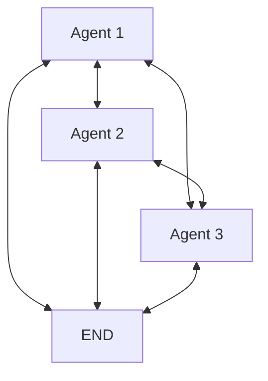
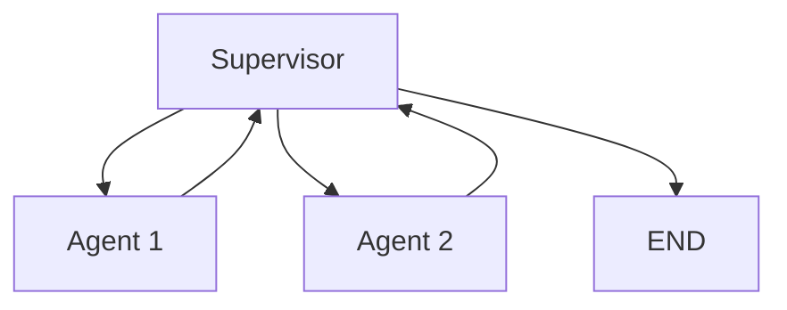
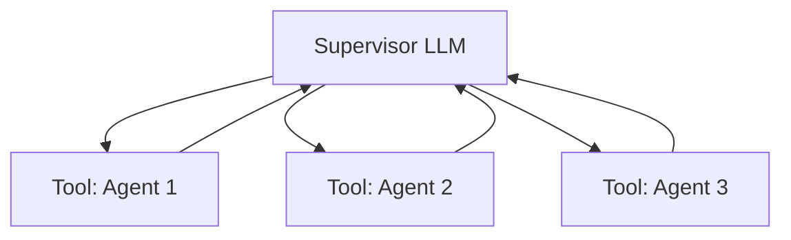
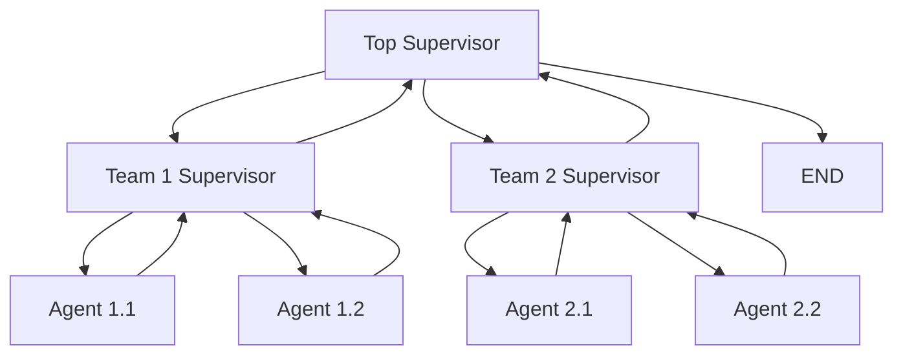
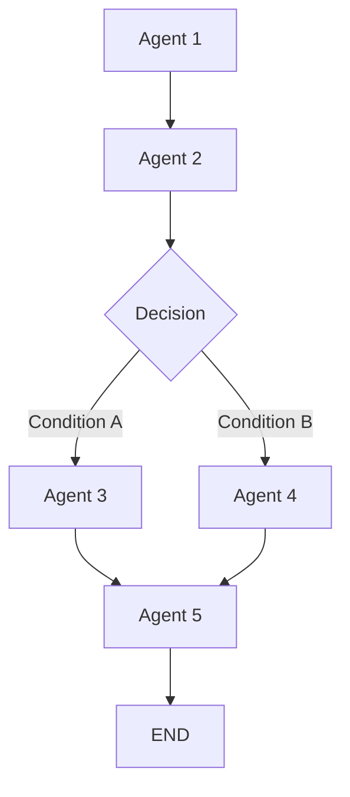

### 1. Network Architecture
In a network architecture, every agent can communicate with every other agent. This creates a flexible, many-to-many communication pattern.

### 2. Supervisor Architecture
In this pattern, a central supervisor coordinates all other agents, making routing decisions.

### 3. Supervisor with Tool-Calling
This approach treats agents as tools that the supervisor can call, leveraging the LLM's natural tool-calling capabilities.

### 4. Hierarchical Architecture
For complex systems, you can create hierarchies with supervisors managing teams of agents.

### 5. Custom Workflow Architecture
This approach defines explicit workflows with some dynamic routing capabilities.

