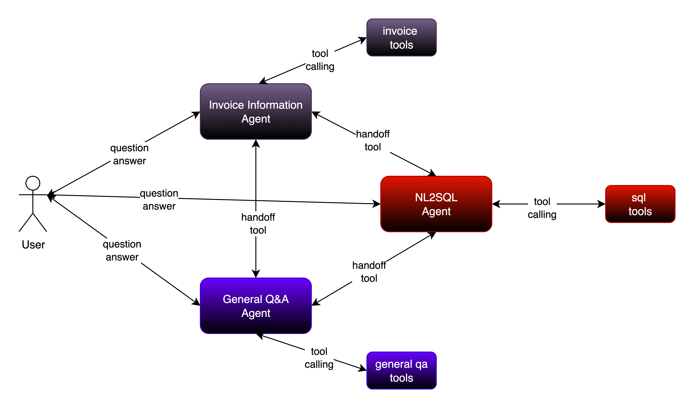

# Multi-Agent Swarm Architecture

A sophisticated multi-agent system built with LangGraph that implements a swarm-style architecture where specialized agents dynamically hand off control to each other based on their area of expertise. The system consists of three specialized sub-agents that work together to handle different types of queries.

## Overview

This project demonstrates how to build a **multi-agent swarm pattern workflow** using **LangGraph**. In a swarm, agents dynamically **hand off control** to each other based on their area of expertise. The system also remembers which agent was last active, so that in future interactions, the conversation seamlessly resumes with that same agent.

## Architecture

The swarm consists of three specialized sub-agents:

### **General QA Agent (RAG)**
- Handles general information queries about companies, documents, or knowledge base content
- Uses Retrieval-Augmented Generation (RAG) to process documents and provide contextual answers
- Serves as the default entry point and coordinator for the swarm

### **NL2SQL Agent**
- Converts natural language questions into SQL queries
- Handles all database-related queries involving albums, artists, tracks, customers, employees
- Works with the Chinook sample database containing music catalog and customer information

### **Invoice Agent**
- Specialized for retrieving and processing invoice information
- Handles billing, payment history, and employee assignment queries
- Provides detailed invoice analysis sorted by date or unit price



## Features

- **Dynamic Agent Handoffs**: Agents automatically transfer control based on query type
- **Persistent Memory**: Maintains conversation context within threads
- **RAG Integration**: Document-based knowledge retrieval for general queries
- **Database Integration**: Natural language to SQL conversion for structured data
- **Multi-turn Conversations**: Supports extended interactions with context retention
- **Error Handling**: Graceful handling of edge cases and query routing


## Project Structure

```
multi-agent-swarm/
├── Multi-Agent-Swarm.ipynb    # Main notebook with implementation
├── README.md                  # This file
├── requirements.txt           # Python dependencies
├── data/                      # Knowledge base documents for RAG
├── chroma_db_swarm/          # Vector database storage (created at runtime)
└── .env                      # Environment variables (create this)
```

## Prerequisites

Before setting up this project, ensure you have the following installed:

- Python 3.10 or higher
- [UV package manager](https://docs.astral.sh/uv/) (recommended) or pip
- Git
- API keys for your chosen LLM provider (Anthropic, OpenAI, Google, or AWS Bedrock)

## Installation and Setup

### Step 1: Clone the Repository

```bash
git clone https://github.com/piyushagni5/langgraph-ai.git
cd langgraph-ai/multi-agent-system/multi-agent-swarm
```

### Step 2: Install UV Package Manager

If you haven't installed UV yet, install it using:

```bash
curl -LsSf https://astral.sh/uv/install.sh | sh
```

For Windows (PowerShell):
```powershell
powershell -c "irm https://astral.sh/uv/install.ps1 | iex"
```

Confirm installation:
```bash
uv --version
```

### Step 3: Create Virtual Environment

```bash
uv venv --python 3.10
```

### Step 4: Activate Virtual Environment

**On macOS/Linux:**
```bash
source .venv/bin/activate
```

**On Windows:**
```bash
.venv\Scripts\activate
```

### Step 5: Install Dependencies

```bash
uv pip install -r requirements.txt
```

### Step 6: Install Jupyter

Install Jupyter Lab for running the notebook:

```bash
uv pip install jupyter jupyterlab
```

### Step 7: Environment Configuration

Create a `.env` file in the project root with your API keys:

```env
# Choose one of the following LLM providers:

# Anthropic (recommended)
ANTHROPIC_API_KEY=your_anthropic_api_key_here

# OpenAI
OPENAI_API_KEY=your_openai_api_key_here

# Google Gemini
GOOGLE_API_KEY=your_google_api_key_here

# Optional: LangSmith for tracing
LANGSMITH_API_KEY=your_langsmith_api_key_here
LANGSMITH_TRACING=true
LANGSMITH_PROJECT=multi-agent-swarm
```

## Usage

### Running the Jupyter Notebook

1. **Install the kernel:**
   ```bash
   uv run python -m ipykernel install --user --name=multi-agent-swarm
   ```

2. **Start Jupyter Lab:**
   ```bash
   uv run jupyter lab
   ```

3. **Open the notebook and connect to the kernel:**
   - Navigate to `Multi-Agent-Swarm.ipynb` in the Jupyter interface
   - Select the "multi-agent-swarm" kernel when prompted

4. **Update API Configuration:**
   - Modify the model initialization in the notebook to use your preferred LLM
   - Uncomment and configure the appropriate model (Anthropic, OpenAI, Google, or AWS Bedrock)

### Interactive Chat Interface

The notebook includes a simple chat interface for testing the multi-agent system:

```python
# Run this cell in the notebook to start the interactive chat
start_chat()
```

### Example Queries

Try these different types of queries to see agent handoffs in action:

**General QA (RAG) Queries:**
- "Tell me about the company's customer service policies"
- "What are the company's core values?"

**Database (NL2SQL) Queries:**
- "Do you have any albums by the Rolling Stones?"
- "How many customers are in the database?"
- "Show me all tracks longer than 5 minutes"

**Invoice Queries:**
- "What was my most recent invoice?" (requires customer_id)
- "Who was the employee that handled my invoice?"
- "Show me my invoices sorted by price"

## Technical Details

### State Management

The system uses a shared state structure that includes:
- `customer_id`: Unique identifier for the current session
- `messages`: Conversation history with automatic message aggregation
- `remaining_steps`: Prevents infinite loops in cyclic graphs
- `active_agent`: Tracks which agent is currently handling the conversation

### Memory Systems

- **Short-term Memory**: Thread-level conversation context using `MemorySaver`
- **Long-term Memory**: Potential for storing user preferences (configurable)

### Agent Communication

Agents communicate through:
- **Handoff Tools**: Specialized tools for transferring control between agents
- **Shared State**: Common state object accessible by all agents
- **Message History**: Preserved conversation context across handoffs

## Customization

### Adding New Agents

1. Create a new ReAct agent using `create_react_agent`
2. Define specialized tools and prompts
3. Add handoff tools to existing agents
4. Include in the swarm workflow creation

### Modifying LLM Provider

Update the model initialization in the notebook:

```python
# Example: Switch to OpenAI
from langchain_openai import ChatOpenAI
model = ChatOpenAI(model="gpt-4o-mini", temperature=0)
```

### Custom Knowledge Base

Replace documents in the `data/` folder with your own knowledge base files (supports .txt files).


## Acknowledgements

This project is built using the powerful LangChain and LangGraph ecosystem:

- **[LangChain](https://github.com/langchain-ai/langchain)**: Framework for developing applications with large language models
- **[LangGraph](https://github.com/langchain-ai/langgraph-101/tree/main/notebooks)**: Library for building stateful, multi-actor applications with LLMs
- **[LangGraph Swarm](https://github.com/langchain-ai/langgraph-swarm-py)**: Extension for building swarm-style multi-agent systems
- **[Chinook Database](https://github.com/lerocha/chinook-database)**: Sample database used for demonstration purposes


## License

This project is licensed under the MIT License. See the [LICENSE](../../LICENSE) file for details.
