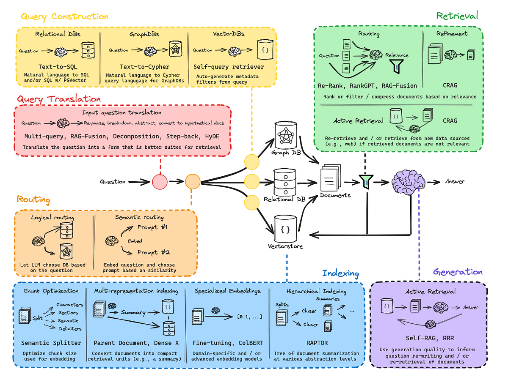
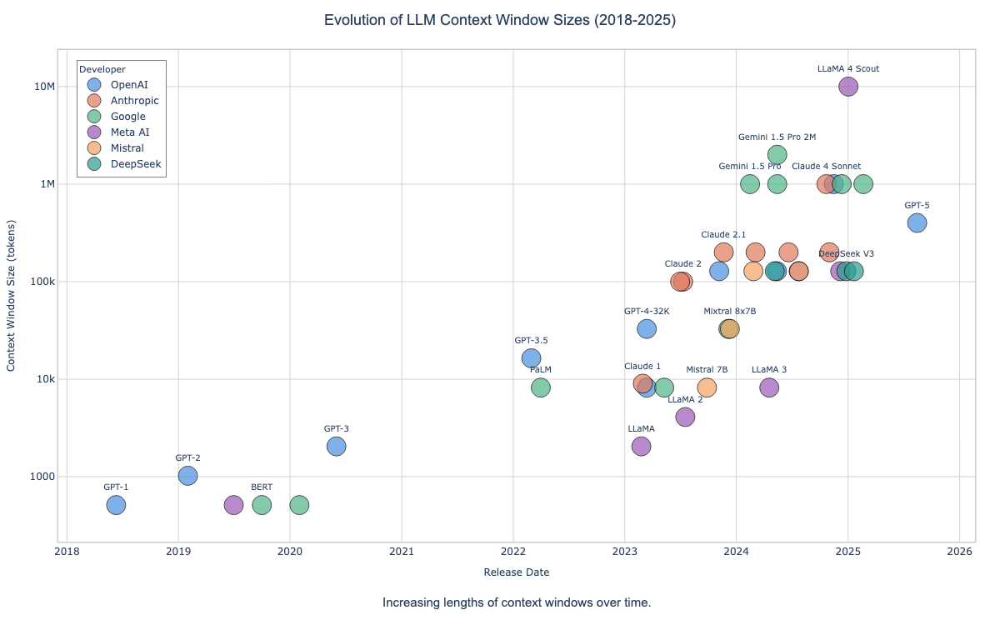
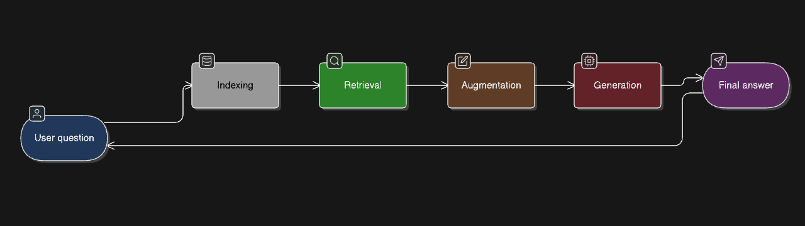

# RAG From Scratch
Retrieval-Augmented Generation, commonly referred to as RAG, has become a foundational pattern for building reliable and scalable applications with large language models. In this blog, we introduce RAG from first principles and explain why it is necessary, how it works, and how a basic RAG pipeline is implemented in practice.



### Why RAG is Needed
Large language models are trained on vast amounts of data, often measured in trillions of tokens. Despite this scale, their knowledge is still inherently limited. There are two major categories of information that language models typically do not have access to:
Private or proprietary data such as internal documents, company knowledge bases, or user-specific information.
Very recent data that was created after the model's training process completed.

No matter how large the pretraining dataset becomes, it will always be incomplete relative to the specific data that an application may require.
At the same time, modern language models now support increasingly large context windows. These have expanded from a few thousand tokens to tens or even hundreds of thousands of tokens. This allows applications to inject substantial amounts of external information directly into a model at inference time.



### What is Retrieval-Augmented Generation (RAG)?
RAG (Retrieval-Augmented Generation) is an AI framework that combines the strengths of traditional information retrieval systems (such as search and databases) with the capabilities of generative large language models (LLMs). By combining your data and world knowledge with LLM language skills, grounded generation is more accurate, up-to-date, and relevant to your specific needs.

Modern RAG systems can be understood through four core components that together form a complete end-to-end pipeline: Indexing, Retrieval, Augmentation, and Generation.



#### Indexing:
Indexing is a preparatory stage that enables efficient and scalable information access during inference. External documents such as PDFs, web pages, or internal knowledge bases are first processed by splitting them into smaller, semantically meaningful chunks. These chunks are then converted into dense vector representations using embedding models and stored in a vector database or other retrieval-friendly storage systems.
Although indexing does not directly participate in inference-time reasoning, it is a foundational component that determines retrieval quality, latency, and system scalability.

#### Retrieval:
Retrieval is responsible for identifying and fetching the most relevant information in response to a user query. When a query is received, it is transformed into an embedding and compared against the indexed document embeddings using similarity search techniques. Modern retrieval systems often employ dense vector search, hybrid retrieval, or transformer-based retrievers to improve semantic relevance.
In more advanced or agentic RAG systems, retrieval may be conditional or adaptive, where the model first decides whether external knowledge is needed before issuing a retrieval request.


#### Augmentation:
Augmentation bridges retrieval and generation by processing the retrieved content before it is passed to the language model. This stage may include filtering irrelevant passages, reranking retrieved results, summarizing long documents, extracting key facts, or restructuring information to better align with the query intent.
Augmentation plays a critical role in ensuring that only high-quality and contextually relevant information is injected into the model prompt, directly influencing response accuracy and factual consistency.

#### Generation:
Generation is the final stage, where the language model synthesizes a response using both its pre-trained knowledge and the augmented external context. The retrieved and processed information is incorporated into the prompt, allowing the model to produce coherent, grounded, and context-aware outputs.
In advanced RAG and agentic frameworks, generation may be iterative, self-reflective, or citation-aware, enabling the model to assess its own outputs, revise responses, or explicitly reference supporting sources.


## Prerequisites

Before setting up this repository, ensure you have the following installed:

- Python 3.10 or higher (depends on the project)
- UV package manager (recommended) or pip
- Git

## Installation and Setup

### Environment Setup Using `uv`

We’ll use [**`uv`**](https://github.com/astral-sh/uv)—a fast Python package manager—for blazing fast environment setup.

#### 1.1 Create and Activate Virtual Environment

```
uv venv rag-env
source rag-env/bin/activate

```

This creates a virtual environment named `rag-env` and activates it.


#### 1.2 Install Required Packages

Now install the core dependencies for this RAG Agent:

```
uv pip install \
    langchain \
    tiktoken \
    langchain-google-genai \
    langchain_community \
    chromadb \
    langchainhub \
    python-dotenv \
    jupyterlab \
    ipykernel

```

#### 1.3 Register Virtual Environment with Jupyter

To make your `rag-env` available as a Jupyter kernel:

```
python -m ipykernel install --user --name=rag-env --display-name "RAG Agent (uv)"

```

Now you can select **RAG Agent (uv)** as the kernel in Jupyter Notebook or JupyterLab.


### 1.4: Environment Configuration

Create a `.env` file in your project directory with the necessary API keys:

```env
GOOGLE_API_KEY="your-google-api-key"
# LANGCHAIN_API_KEY="your-langchain-api-key"  # optional
# LANGCHAIN_TRACING_V2=True                   # optional
# LANGCHAIN_PROJECT="multi-agent-swarm"       # optional
```

## License

This project is open source and available under the MIT License.

## Acknowledgements

- Original LangChain repository: [LangChain](https://github.com/langchain-ai/rag-from-scratch/blob/main/)
